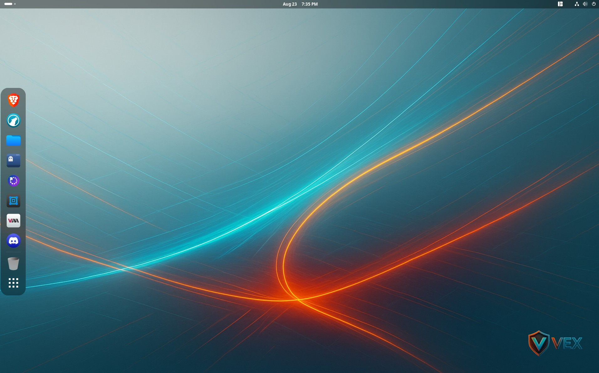
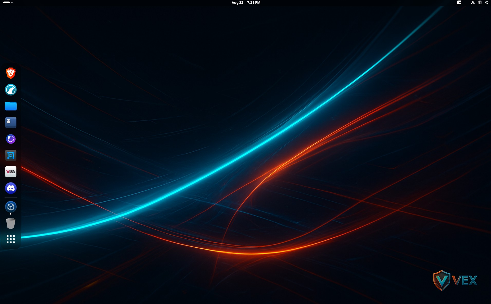

<p align="center">
	
</p>

# [](https://github.com/VictoryTek/vex-os/actions/workflows/build.yml)

Custom Fedora Atomic (ostree native container) image built with [BlueBuild](https://blue-build.org), based on the Bazzite GNOME variants and personalized with tooling, Flatpaks, GNOME extensions, theming, and wallpapers.

## Screenshots
<p align="center">
	<a href="./vex-screenshot1.jpg" title="Desktop Light"></a>
	<a href="./vex-screenshot2.jpg" title="Desktop Dark"></a>
</p>

## Variants
- `vex-os` (standard GNOME DE)
- `vex-os-nvidia` (standard GNOME DE includes NVIDIA stack)
- `vex-os-cosmic` (standard COSMIC DE)
- `vex-os-cosmic-nvidia` (standard COSMIC DE includes NVIDIA stack)


## Features (short list)
- Gnome DE (I dont like KDE) (maybe Cosmic in the future)
- Developer + container tools (Docker, buildah, skopeo, virtualization group)
- VS Code, Ghostty, Starship
- Curated Flatpaks (Brave, LibreWolf, Bitwarden, etc.)
- GNOME extensions (Dash to Dock, Wallpaper Slideshow, more)
- Branded wallpapers with light/dark pairing & defaults
- Signed images (cosign)

## Rebase / Install
> Uses the [experimental native container](https://www.fedoraproject.org/wiki/Changes/OstreeNativeContainerStable) flow.

Pick ONE variant and substitute below.

1. Rebase first to the UNSIGNED image (installs trust policy + keys inside the image):
```
# GNOME variant
sudo rpm-ostree rebase ostree-unverified-registry:ghcr.io/victorytek/vex-os:latest

# GNOME + NVIDIA
sudo rpm-ostree rebase ostree-unverified-registry:ghcr.io/victorytek/vex-os-nvidia:latest

# COSMIC DE variant  
sudo rpm-ostree rebase ostree-unverified-registry:ghcr.io/victorytek/vex-os-cosmic:latest

# COSMIC DE + NVIDIA
sudo rpm-ostree rebase ostree-unverified-registry:ghcr.io/victorytek/vex-os-cosmic-nvidia:latest
```

2. Reboot:
```
systemctl reboot
```

3. Rebase to the SIGNED image:
```
# GNOME variant
sudo rpm-ostree rebase ostree-image-signed:docker://ghcr.io/victorytek/vex-os:latest

# GNOME + NVIDIA
sudo rpm-ostree rebase ostree-image-signed:docker://ghcr.io/victorytek/vex-os-nvidia:latest

# COSMIC DE variant
sudo rpm-ostree rebase ostree-image-signed:docker://ghcr.io/victorytek/vex-os-cosmic:latest

# COSMIC DE + NVIDIA  
sudo rpm-ostree rebase ostree-image-signed:docker://ghcr.io/victorytek/vex-os-cosmic-nvidia:latest
```

4. Reboot again:
```
systemctl reboot
```

### Testing Variant (Optional)
To rebase to the test variant for development/testing purposes:

1. Rebase to UNSIGNED test image:
```
sudo rpm-ostree rebase ostree-unverified-registry:ghcr.io/victorytek/vex-os-test:latest
```

2. Reboot:
```
systemctl reboot
```

3. Rebase to SIGNED test image:
```
sudo rpm-ostree rebase ostree-image-signed:docker://ghcr.io/victorytek/vex-os-test:latest
```

4. Reboot again:
```
systemctl reboot
```

The `latest` tag tracks the newest build, but the Fedora release stays fixed to what the recipe specifies until manually changed.

## Updating
Stay on the same variant:
```
sudo rpm-ostree upgrade
```
Or explicitly rebase again (helpful if you changed channels):
```
sudo rpm-ostree rebase ostree-image-signed:docker://ghcr.io/victorytek/vex-os:latest
```

## Verification (Supply Chain)
Images are signed with [cosign](https://github.com/sigstore/cosign). Verify (example for NVIDIA):
```
cosign verify --key cosign.pub ghcr.io/victorytek/vex-os-gnome-nvidia:latest
```
Expect a successful signature from the maintained key in `cosign.pub`.

## ISO (Optional)
If you want an installable ISO, follow the upstream guide: https://blue-build.org/learn/universal-blue/#fresh-install-from-an-iso (hosting large ISOs isn’t included here).

## Changelog
Upstream base changes (Bazzite) can be tracked here: [Changelog](https://github.com/ublue-os/bazzite/blob/main/CHANGELOG.md)

## Credits
Built on the BlueBuild ecosystem and ublue-os Bazzite base. 

---